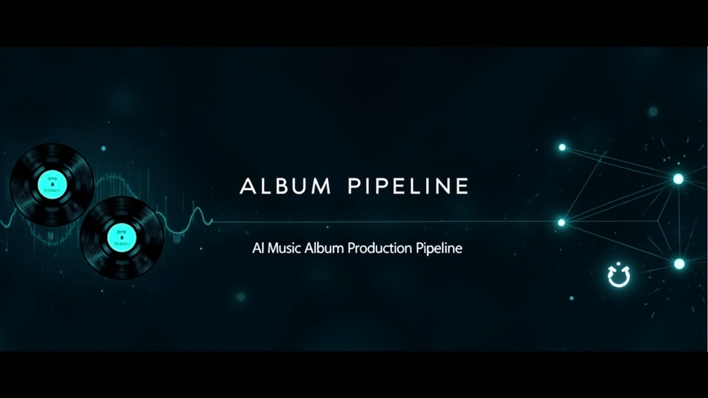

<p align="center">
  
</p>

<h1 align="center">Album Pipeline</h1>

<p align="center">
  <strong>AI music album production pipeline — from concept to release, fully automated</strong><br/>
  <em>Powered by <a href="https://github.com/MiniMax-AI/cli">MiniMax CLI</a></em>
</p>

<p align="center">
  
  
  
  
</p>

<p align="center">
  <a href="#architecture">Architecture</a> ·
  <a href="#phase-details">Phase Details</a> ·
  <a href="#directory-structure">Directory Structure</a> ·
  <a href="#file-contracts">File Contracts</a> ·
  <a href="#usage">Usage</a> ·
  <a href="#roadmap">Roadmap</a>
</p>

---

## Overview

Album Pipeline is an **OpenClaw Skill** that automates the entire AI music album creation process — from an initial concept conversation to a fully packaged, release-ready album with cover art, promotional materials, and platform-compliant audio deliverables. It runs entirely inside OpenClaw, orchestrating specialized sub-agents through 6 sequential phases.

**Key numbers:**
- **6 Phases** — concept → songwriting → lyrics → generation → selection → packaging
- **5 Experts** per song — lyrics, arrangement, rhyme, market, scoring — iterating serially
- **3–6 Rounds** per song — minimum 3 rounds, maximum 6, score must reach ≥ 80 to pass
- **Bilingual** — Chinese + English albums produced in parallel
- **Parallel by song, serial by expert** — N songs run simultaneously; within each song, experts work one after another

---

## Features

| | |
|---|---|
| 🎵 **End-to-End Automation** | 6 phases cover every step from concept to release |
| 🧠 **5-Expert Iteration** | Lyrics / Arrangement / Rhyme / Market / Scoring — each a dedicated sub-agent |
| 🔄 **Quality Gate** | Every song must score ≥ 80 before advancing; 3–6 automatic rounds |
| 📝 **Absolute File Contracts** | Input/output paths and formats are strictly defined — any deviation is a bug |
| 🌐 **Bilingual Albums** | Chinese + English lyrics, music, and promotional materials produced in parallel |
| 🎨 **AI Cover Generation** | 3 visual strategy prompts × MiniMax image-01 → album + track cover art |
| 🎬 **Promo Video Generation** | MiniMax video model → 30s + 15s promotional videos with cover-frame reference |
| 📦 **One-Click Packaging** | Cover art, artist story, promo docs, videos, and platform compliance checks |

---

## Architecture

```
Phase 1: Album Concept         → Narrative arc + track lineup + tonal definition
           ↓
Phase 2: Song Writing           → 5 experts × 3–6 rounds per song (N songs in parallel)
           ↓
Phase 3: Lyrics Formatter       → Structure tagging (Verse/Chorus/Bridge) + char limit check
           ↓
Phase 4: Music Generator        → MiniMax CLI multi-Take parallel generation
           ↓
Phase 5: Audio Transcoder       → Listener selection + 320kbps / 44.1kHz transcoding
           ↓
Phase 6: Album Packager         → Cover concept → AI cover generation → Promo video → Packaging
```

---

## Phase Details

### Phase 1 — Album Concept

**Input:** User-provided core theme or creative direction  
**Output:** `docs/album-overview.md` — narrative arc + track positioning + tonal definition

Four creative experts run in parallel, then a chief reviewer consolidates:

| Expert | Role |
|---|---|
| 🎭 Creative Director | Narrative arc and emotional arc |
| 📊 Market Analyst | Target audience and competitive landscape |
| 🎼 Music Director | Genre positioning and tonal direction |
| ⭐ Chief Reviewer | Composite score and consistency check |

### Phase 2 — Song Writing

Each song runs through **5 experts in serial order**, repeated for **3–6 rounds**:

```
Lyrics Expert → Arrangement Expert → Rhyme Expert → Market Expert → Scoring Expert
                                                                              ↓
                                                                        Score ≥ 80?
                                              ├─ Yes + Round ≥ 3 → ✅ Pass
                                              └─ No → Targeted revision → Next Round
```

| Rule | Value |
|---|---|
| Minimum rounds | 3 (even if Round 1 scores 95) |
| Maximum rounds | 6 (take the highest-scoring version) |
| Between songs | **Parallel** (N songs run simultaneously) |
| Within a song | **Serial** (5 experts operate on the same file in sequence) |

### Phase 3 — Lyrics Formatter

- Extracts structural tags (Verse / Chorus / Bridge / Intro / Outro)
- Validates character limit (≤ 3,500 characters)
- Outputs a validation report + metadata

### Phase 4 — Music Generator

| Step | Description |
|---|---|
| 4.1 Prompt Generation | 3 versions of generation prompts per song |
| 4.2 Prompt Review | Review and optimize prompt quality |
| 4.3 CLI Execution | MiniMax CLI parallel generation of multiple Takes |

### Phase 6 — Album Packager

| Sub-phase | Step | Description |
|---|---|---|
| 6.1 | Album Overview Updater | Updates the album master document |
| 6.2 | Promotional Writer | Album press release and marketing copy |
| 6.3 | Artist Story Writer | Creative journey and backstory |
| 6.4 | Cover Designer | Album cover concept (≥3 directions + HEX palette) |
| 6.4.5 | Cover Prompt Generator | 3 visual strategy prompts for image-01 |
| 6.4.6 | Cover Executor | MiniMax image-01 → album + track covers (PNG) |
| 6.5 | *(reserved)* | — |
| 6.7 | Promo Video Executor | MiniMax video → 30s + 15s promo videos |
| 6.8 | Platform Checker | Format compliance check |
| 6.9 | Final Packager | Archives all deliverables |

### Phase 5 — Audio Transcoder

- 👂 **Listener Selection** — user picks the final Take from multiple candidates
- ✅ **Quality Verification** — post-transcode validation at 320kbps / 44.1kHz

### Phase 6 — Album Packager

| Sub-module | Responsibility |
|---|---|
| 📋 Album Overview Updater | Updates the album master document |
| 📢 Promotional Writer | Album press release and marketing copy |
| 🎤 Artist Story Writer | Creative journey and backstory |
| 🎨 Cover Designer | Album cover concept and design suggestions |
| 🖼️ Cover Prompt Generator | Translates cover concepts into image-generation prompts (3 visual strategies) |
| 🖼️ Cover Executor | MiniMax image-01 → album + track cover art (PNG, 2048×2048) |
| 🔍 Platform Checker | Format compliance check for each music platform |
| 🎬 Promo Video Executor | MiniMax video model → promotional videos (30s + 15s) |
| 📦 Final Packager | Archives all deliverables (docs + covers + videos + audio) |

---

## Directory Structure

```
album-pipeline/
├── SKILL.md                              ← Main entry point
├── FILE_CONTRACTS.md                     ← Absolute file contracts
├── album-concept/                        ← Phase 1: Concept design
├── song-writer/                          ← Phase 2: Orchestrator
├── song-expert-lyrics/                   ← Phase 2: Lyrics expert
├── song-expert-arrangement/              ← Phase 2: Arrangement expert
├── song-expert-rhyme/                    ← Phase 2: Rhyme expert
├── song-expert-market/                   ← Phase 2: Market expert
├── song-expert-scoring/                  ← Phase 2: Scoring expert
├── lyrics-formatter/                     ← Phase 3: Lyrics formatter
├── phase4-prompt-generator/              ← Phase 4.1: Prompt generation
├── phase4-prompt-reviewer/              ← Phase 4.2: Prompt review
├── phase4-music-executor/                ← Phase 4.3: MiniMax CLI execution
├── phase5-listener-selector/             ← Phase 5.1: Listener selection
├── phase5-quality-verifier/             ← Phase 5.2: Quality verification
├── phase6-album-overview-updater/        ← Phase 6.1: Album overview updater
├── phase6-promotional-writer/           ← Phase 6.2: Promotional copy
├── phase6-artist-story-writer/          ← Phase 6.3: Artist story
├── phase6-cover-designer/                ← Phase 6.4: Cover concept
├── phase6-cover-prompt-generator/        ← Phase 6.4.5: Cover prompt generation
├── phase6-cover-executor/                ← Phase 6.4.6: MiniMax image generation
├── phase6-platform-checker/              ← Phase 6.8: Platform compliance
├── phase6-promo-video-executor/          ← Phase 6.7: Promo video generation
├── phase6-packager/                      ← Phase 6.9: Final packager
├── audio-transcoder/                     ← Phase 5: Transcoder orchestrator
├── album-packager/                       ← Phase 6: Packager orchestrator
├── assets/                               ← Banner hero image
├── docs/
│   └── production-pipeline-review.md     ← Full production pipeline retrospective
└── examples/
    ├── songs/T1-出发.md                 ← Example song (98-point final draft)
    ├── lyrics/cn/                       ← Example Chinese lyrics
    └── album-overview.md                ← Example album overview
```

---

## File Contracts

All Phase input/output file paths, formats, and required fields are strictly defined in `FILE_CONTRACTS.md`.

> **This is the pipeline's constitution. No expert or sub-agent may deviate.**

| Rule | Description |
|---|---|
| Read/write routes strictly per contract | Each expert knows exactly what to read and what to write |
| File formats strictly per contract | Block order, field validation, required fields — no exceptions |
| Any deviation = bug, must be fixed | Contracting is mandatory; violations are treated as defects |

See [`FILE_CONTRACTS.md`](FILE_CONTRACTS.md) for the full specification.

---

## Usage

### How to Trigger

```
User: 做一张专辑
User: album pipeline
User: AI 音乐专辑
```

Any of the above phrases starts the pipeline.

### Example Flow

```
You: Make an album about the concept of "Departure" — 3 songs
         ↓
Phase 1: Concept complete — narrative arc + 3-track positioning
         ↓
Phase 2: 5 experts × 6 rounds — lyrics + arrangement + market evaluation per song
         ↓
Phase 3: Lyrics standardized — structural tags + character validation
         ↓
Phase 4: MiniMax CLI generation — multiple Takes per song in parallel
         ↓
Phase 5: Listener selects final Take → Transcoding + quality verification
         ↓
Phase 6: Packaging — cover + artist story + promotional docs + platform checks
         ↓
✅ A complete, release-ready album
```

### Instrumental Support

Even for fully instrumental albums, all 6 phases run. Instrumental tracks are marked during Phase 1, skip the lyrics step in Phase 2 (replaced by instrumental descriptions), and the rest of the pipeline remains unchanged.

---

## Documentation

| Document | Description |
|---|---|
| [Production Pipeline Review](docs/production-pipeline-review.md) | Full process retrospective and lessons learned |
| [File Contracts](FILE_CONTRACTS.md) | Input/output paths, formats, and field definitions |
| [Example Song](examples/songs/T1-出发.md) | A 98-point final-draft song example |
| [Lyrics Examples](examples/lyrics/cn/) | Standardized Chinese lyrics output examples |

---

## Roadmap

- [x] **Phase 1–6 Core Architecture** — full chain from concept to packaging
- [x] **Multi-Expert Parallelism** — 5 independent sub-agents per song
- [x] **Bilingual Albums** — Chinese + English produced in parallel
- [ ] **Quality Tuning Experiments** — data collection on MiniMax generation quality vs. duration
- [ ] **More Genre Templates** — Pop / Electronic / Folk / Classical presets
- [ ] **Visual Dashboard** — real-time pipeline progress and score tracking

---

## License

MIT License — See [LICENSE](LICENSE)

---

## Acknowledgments

- 🎵 **MiniMax Music** — high-quality music generation engine
- 🛠️ **OpenClaw** — agent orchestration framework and sub-agent infrastructure

---

<!-- ═══════════════════════════════════════════════════════════════ -->

<p align="center">
  
</p>

<h1 align="center">Album Pipeline</h1>

<p align="center">
  <strong>AI 音乐专辑制作流水线</strong><br/>
  <em>从概念构思到发布打包，全程自动化</em>
</p>

<p align="center">
  
  
  
  
</p>

<p align="center">
  <a href="#架构总览">架构总览</a> ·
  <a href="#各阶段详解">各阶段详解</a> ·
  <a href="#目录结构">目录结构</a> ·
  <a href="#文件契约">文件契约</a> ·
  <a href="#使用方式">使用方式</a> ·
  <a href="#路线图">路线图</a>
</p>

---

## 概述

Album Pipeline 是一个**OpenClaw Skill**，负责自动化整个 AI 音乐专辑创作流程——从最初的概念对话，到包含封面、宣传物料和符合平台规范的音频成品的完整发布包。全程运行在 OpenClaw 内部，通过 6 个顺序阶段协调专用子 agent 完成。

**核心数字：**
- **6 个 Phase** — 概念 → 作词 → 歌词 → 生成 → 听选 → 打包
- **5 位专家** 每首歌 — 作词、编曲、韵脚、市场、评分，各为一个独立子 agent
- **3–6 轮迭代** 每首歌 — 最少 3 轮，最多 6 轮，分数必须达到 ≥ 80 才能通过
- **双语并行** — 中文 + 英文专辑同步产出
- **歌曲间并行，专家间串行** — N 首歌同时运行；每首歌内部专家依次操作

---

## 核心特性

| | |
|---|---|
| 🎵 **全流程自动化** | 6 个 Phase 覆盖从概念到发布的每一步 |
| 🧠 **5 位专家迭代** | 作词 / 编曲 / 韵脚 / 市场 / 评分 — 每位都是专用子 agent |
| 🔄 **质量门禁** | 每首歌必须达到 ≥ 80 分才可通过，自动进行 3–6 轮迭代 |
| 📝 **绝对文件契约** | 输入/输出路径和格式严格定义，任何偏离即视为 bug |
| 🌐 **双语专辑** | 中文 + 英文歌词、音乐、宣传物料同步产出 |
| 🎨 **AI 封面生成** | 3 种视觉策略 Prompt × MiniMax image-01 → 专辑 + 单曲封面图 |
| 🎬 **宣传视频生成** | MiniMax 视频模型 → 30秒 + 15秒宣传短视频（封面首帧参考） |
| 📦 **一键发布打包** | 封面图、艺人说、宣传文档、视频、平台合规检查一体化 |

---

## 架构总览

```
Phase 1: 专辑概念设计       → 叙事轴线 + 曲目定位 + 调性定义
           ↓
Phase 2: 歌曲创作           → 每首歌 5 位专家串行 × 3–6 轮（N 首歌并行）
           ↓
Phase 3: 歌词标准化          → 结构标签提取（Verse/Chorus/Bridge）+ 字符限制校验
           ↓
Phase 4: 音乐生成            → MiniMax CLI 多 Take 并行生成
           ↓
Phase 5: 音频转码            → 听评选定 + 320kbps / 44.1kHz 转码验证
           ↓
Phase 6: 专辑打包            → 封面概念 → AI 封面生成 → 宣传视频 → 打包归档
```

---

## 各阶段详解

### Phase 1 — 专辑概念设计

**输入：** 用户提供的核心主题或创作方向  
**输出：** `docs/album-overview.md` — 叙事轴线 + 曲目定位 + 调性定义

4 位创意专家并行分析，总评专家汇总：

| 专家 | 职责 |
|---|---|
| 🎭 创意总监 | 叙事弧线与情感走向 |
| 📊 市场专家 | 目标受众与竞品分析 |
| 🎼 音乐总监 | 曲风定位与调性建议 |
| ⭐ 总评专家 | 综合评分与一致性检查 |

### Phase 2 — 歌曲创作

每首歌经历 **5 位专家串行执行**，重复 **3–6 轮**：

```
作词专家 → 编曲专家 → 韵脚专家 → 市场专家 → 评分专家
                                                        ↓
                                                  评分 ≥ 80？
                                            ├─ 是 + 轮次 ≥ 3 → ✅ 通过
                                            └─ 否 → 针对性优化 → 下一轮
```

| 规则 | 说明 |
|---|---|
| 最少轮次 | 3 轮（即使第 1 轮就 95 分也要跑满） |
| 最多轮次 | 6 轮（取最高分版本） |
| 歌曲间 | **并行**（N 首歌同时跑） |
| 歌曲内 | **串行**（5 位专家依次操作同一文件） |

### Phase 3 — 歌词标准化

- 提取结构标签（Verse / Chorus / Bridge / Intro / Outro）
- 校验字符限制（≤ 3,500 字符）
- 输出验证报告 + metadata

### Phase 4 — 音乐生成

| 步骤 | 说明 |
|---|---|
| 4.1 Prompt 生成 | 每首歌 3 个版本的生成 Prompt |
| 4.2 Prompt 审查 | 审查优化 Prompt 质量 |
| 4.3 CLI 执行 | MiniMax CLI 多 Take 并行生成音频 |

### Phase 6 — 专辑打包

| 子阶段 | 步骤 | 说明 |
|---|---|---|
| 6.1 | 专辑统筹更新 | 更新专辑总览文档 |
| 6.2 | 宣传文案 | 专辑新闻稿与营销文案 |
| 6.3 | 艺人说文案 | 创作历程与心路故事 |
| 6.4 | 封面概念设计 | 专辑封面设计建议（≥3 方向 + HEX 配色） |
| 6.4.5 | 封面 Prompt 生成 | 3 种视觉策略 Prompt 供 image-01 使用 |
| 6.4.6 | 封面图生成 | MiniMax image-01 → 专辑 + 单曲封面图（PNG） |
| 6.5 | *（保留）* | — |
| 6.7 | 宣传视频生成 | MiniMax 视频模型 → 30秒 + 15秒宣传视频 |
| 6.8 | 平台适配检查 | 各音乐平台格式合规核对 |
| 6.9 | 最终打包 | 所有产物整理归档 |

### Phase 5 — 音频转码

- 👂 **听评选定** — 用户从多个 Take 中选择最终版本
- ✅ **质量验证** — 转码后 320kbps / 44.1kHz 校验

### Phase 6 — 专辑打包

| 子模块 | 职责 |
|---|---|
| 📋 专辑统筹更新 | 更新专辑总览文档 |
| 📢 宣传文案 | 专辑新闻稿与营销文案 |
| 🎤 艺人说文案 | 创作历程与心路故事 |
| 🎨 封面概念设计 | 专辑封面设计建议 |
| 🖼️ 封面 Prompt 生成 | 将封面概念翻译为图片生成 Prompt（3 种视觉策略） |
| 🖼️ 封面图生成 | MiniMax image-01 → 专辑 + 单曲封面图（PNG, 2048×2048） |
| 🔍 平台适配检查 | 各音乐平台格式合规核对 |
| 🎬 宣传视频生成 | MiniMax 视频模型 → 宣传短视频（30秒 + 15秒） |
| 📦 最终打包 | 所有产物整理归档（文档 + 封面图 + 视频 + 音频） |

---

## 目录结构

```
album-pipeline/
├── SKILL.md                              ← 总入口
├── FILE_CONTRACTS.md                     ← 绝对文件契约
├── album-concept/                        ← Phase 1：概念设计
├── song-writer/                          ← Phase 2：编排器
├── song-expert-lyrics/                   ← Phase 2：作词专家
├── song-expert-arrangement/              ← Phase 2：编曲专家
├── song-expert-rhyme/                    ← Phase 2：韵脚专家
├── song-expert-market/                  ← Phase 2：市场专家
├── song-expert-scoring/                  ← Phase 2：评分专家
├── lyrics-formatter/                     ← Phase 3：歌词标准化
├── phase4-prompt-generator/              ← Phase 4.1：Prompt 生成
├── phase4-prompt-reviewer/              ← Phase 4.2：Prompt 审查
├── phase4-music-executor/                ← Phase 4.3：MiniMax CLI 执行
├── phase5-listener-selector/             ← Phase 5.1：听评选定
├── phase5-quality-verifier/             ← Phase 5.2：质量验证
├── phase6-album-overview-updater/        ← Phase 6.1：专辑统筹更新
├── phase6-promotional-writer/           ← Phase 6.2：宣传文案
├── phase6-artist-story-writer/          ← Phase 6.3：艺人说
├── phase6-cover-designer/                ← Phase 6.4：封面概念
├── phase6-cover-prompt-generator/        ← Phase 6.4.5：封面 Prompt 生成
├── phase6-cover-executor/                ← Phase 6.4.6：MiniMax 图片生成
├── phase6-platform-checker/              ← Phase 6.8：平台适配检查
├── phase6-promo-video-executor/          ← Phase 6.7：宣传视频生成
├── phase6-packager/                      ← Phase 6.9：最终打包
├── audio-transcoder/                     ← Phase 5：转码编排器
├── album-packager/                       ← Phase 6：打包编排器
├── assets/                               ← Banner 横幅图片
├── docs/
│   └── production-pipeline-review.md     ← 完整生产流程回顾
└── examples/
    ├── songs/T1-出发.md                ← 范例歌曲（98 分终稿）
    ├── lyrics/cn/                       ← 中文歌词范例
    └── album-overview.md                ← 专辑总览范例
```

---

## 文件契约

所有 Phase 的输入/输出文件路径、格式、必填字段严格定义在 `FILE_CONTRACTS.md` 中。

> **这是流水线的宪法。任何专家/子 agent 不得偏离。**

| 规则 | 说明 |
|---|---|
| 读写路由严格按契约 | 每位专家明确知道该读什么、该写什么 |
| 文件格式严格按契约 | 区块顺序、字段校验、必填项——不许有例外 |
| 任何偏离 = bug，必须修复 | 契约即规范，违反即缺陷 |

详见 [`FILE_CONTRACTS.md`](FILE_CONTRACTS.md)。

---

## 使用方式

### 触发方式

```
用户：做一张专辑
用户：album pipeline
用户：AI 音乐专辑
```

以上任意语句均可启动流水线。

### 示例流程

```
你：做一张关于「出发」概念的专辑，3 首歌
         ↓
Phase 1：概念设计完成 — 叙事轴线 + 3 首曲目定位
         ↓
Phase 2：5 位专家 × 6 轮迭代 — 每首歌产出歌词 + 编曲 + 市场评估
         ↓
Phase 3：歌词标准化 — 结构标签 + 字符校验
         ↓
Phase 4：MiniMax CLI 生成 — 每首歌多 Take 并行
         ↓
Phase 5：听评选定 — 用户选择最终 Take → 转码验证
         ↓
Phase 6：打包发布 — 封面 + 艺人说 + 宣传文档 + 平台适配
         ↓
✅ 一张完整的、可直接发布的专辑
```

### 纯音乐支持

即使整张专辑全部为纯音乐，6 个 Phase 的骨架依然完整运行。纯音乐曲目在 Phase 1 标注「纯音乐」，Phase 2 跳过歌词环节改为器乐描述，其余流程不变。

---

## 文档

| 文档 | 说明 |
|---|---|
| [生产流程回顾](docs/production-pipeline-review.md) | 完整流程回顾与经验总结 |
| [文件契约](FILE_CONTRACTS.md) | 输入/输出路径、格式、字段定义 |
| [范例歌曲](examples/songs/T1-出发.md) | 98 分终稿歌曲示例 |
| [歌词范例](examples/lyrics/cn/) | 标准化中文歌词输出示例 |

---

## 路线图

- [x] **Phase 1–6 基础架构** — 概念设计 → 打包发布全链路打通
- [x] **多专家并行** — 5 位专家独立子 agent 串行迭代
- [x] **中英双语专辑** — 同一专辑同时产出中英文版本
- [ ] **质量调优实验** — MiniMax 生成质量随时长的数据收集
- [ ] **更多曲风模板** — 流行 / 电子 / 民谣 / 古典等预设
- [ ] **可视化看板** — 流水线进度 / 评分实时追踪

---

## 许可证

Copyright © Raylan LIN。保留所有权利。

---

## 致谢

- 🎵 **MiniMax Music** — 高质量音乐生成引擎
- 🛠️ **OpenClaw** — Agent 编排框架与子 agent 基础设施
